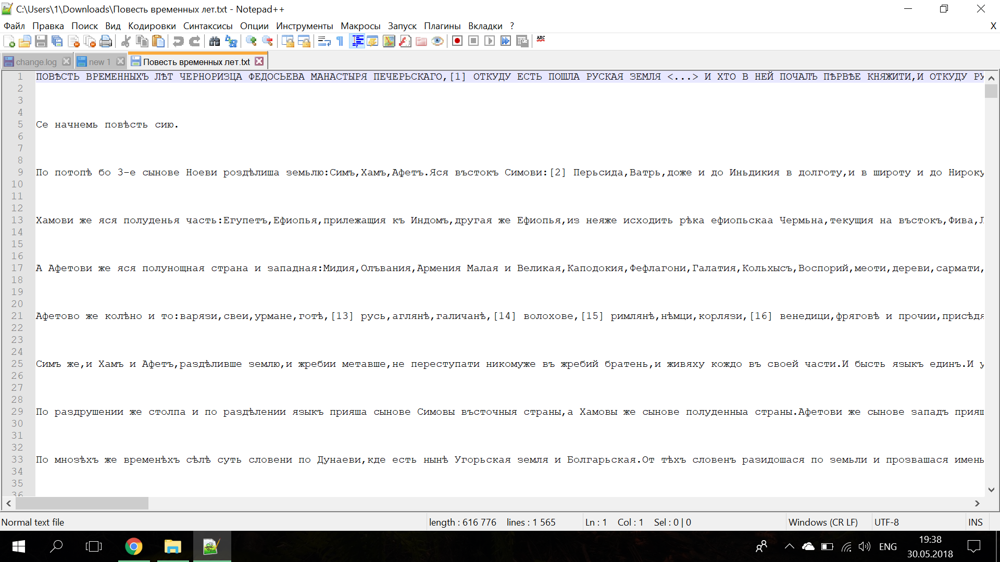
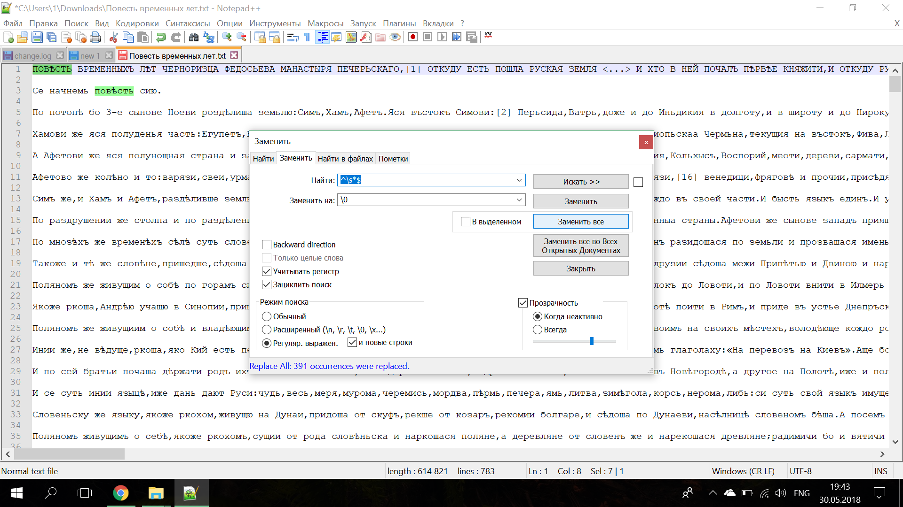
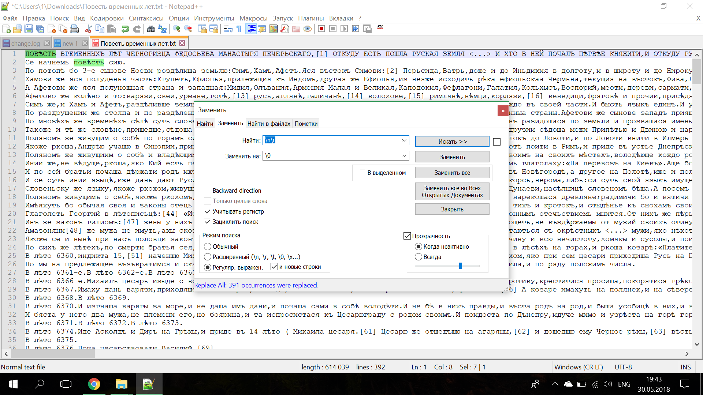
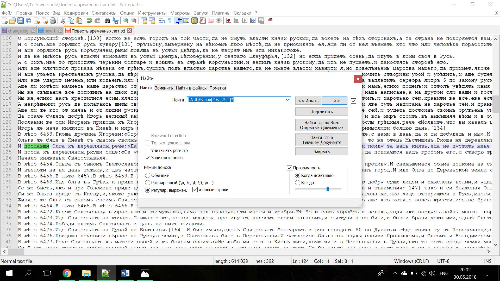
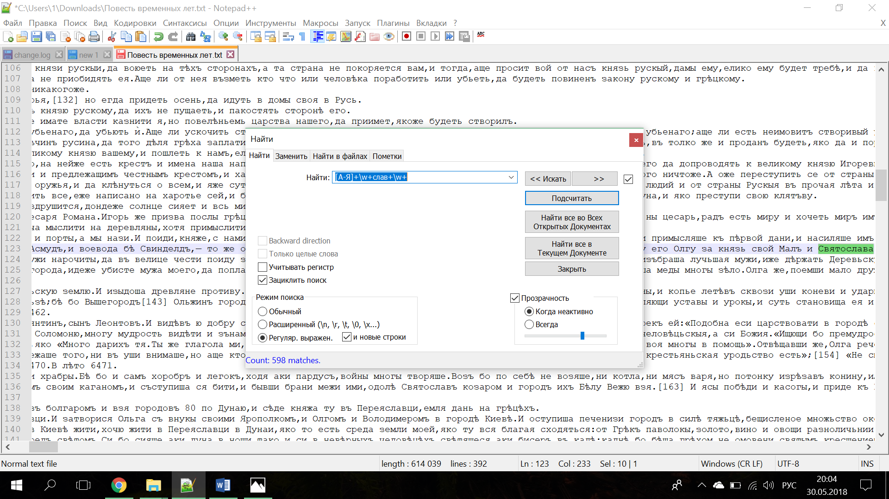
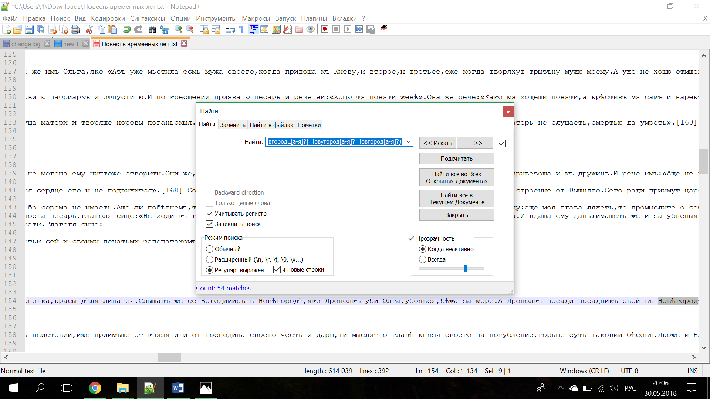

# hw9

## Работа в Notepad++ и редактирование летописи

Я работала в Notepad++ , предварительно найдя в Интернете "регулярки" для данной программы:

 

# Задание 1:
Шаг 1.
Использовала регулярное выражение: ^\s*$  , заменила все вхождения на \0

Шаг 2. Использовала регулярное выражение: \n\r , заменила все вхождения на \0

# Задание 2:

Использовала регулярное выражение: [А-Я]\Sслав[^\s.,?!:;-]*  , но оно было не верным, так как в найденных результах, я случайно набрела на слово "пославши":

Попробовала данное выражение: [А-Я]+\w+слав+\w+

Всего упоминаний о князьях нашла: **598**

# Задание 3:

Использовала регулярное выражение:  (Новѣ?город[а-я]?|Новъ?город[а-я]?|Новгородц[а-я]?| Новугород[а-я]?|Новгород[а-я]?)

Всего упоминаний Новгорода нашла: **54** с учетом регистра

